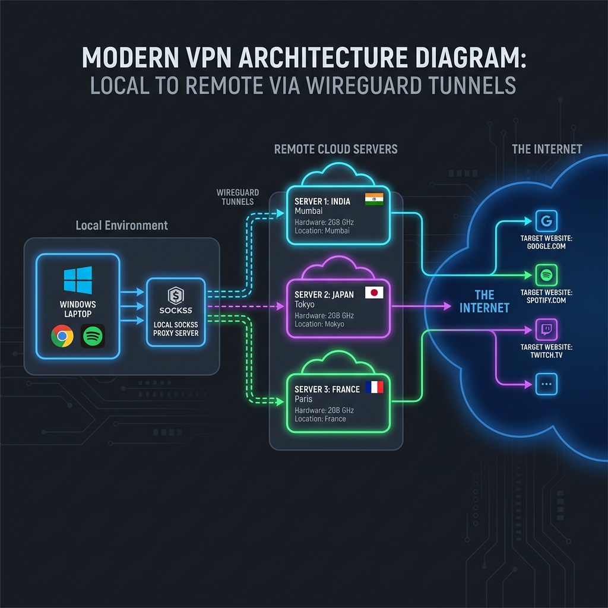
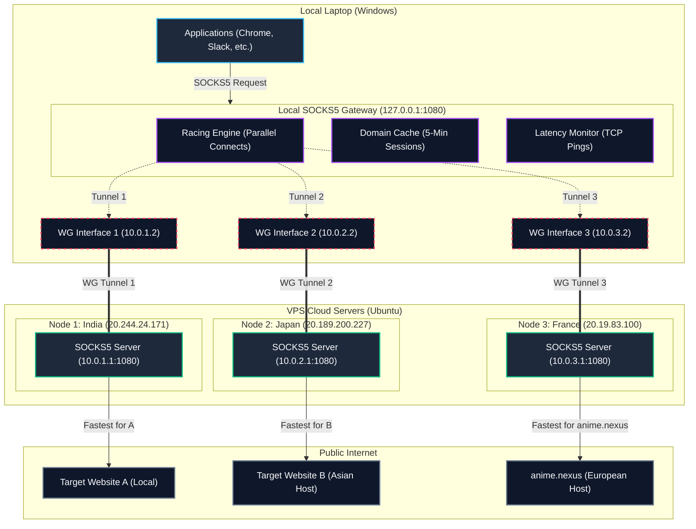

# ▲ Custom VPN Architecture Diagram

This diagram visualizes how traffic flows from your local applications, through the Handshake Racing SOCKS5 Gateway and concurrent WireGuard tunnels, to the remote VPS nodes and final web destinations.

## Architecture Diagram

### Mermaid Flowchart Representation

---

## Component Explanations

1. **Applications**: Your browser or desktop tools make proxy requests to `127.0.0.1:1080`.
2. **Racing Engine**: Resolves target hosts and launches concurrent connection handshakes through India, Japan, and France.
3. **Domain Cache**: Records the winning optimal node for each host (e.g. caches France for `anime.nexus`) so that subsequent connection loads bypass the racing stage for 5 minutes.
4. **Latency Monitor**: Routinely tests pings to all active nodes so the proxy only races online, healthy tunnels.
5. **WireGuard Tunnels**: Private point-to-point tunnels (`10.0.X.2` to `10.0.X.1`) established concurrently via split-tunneling.
6. **VPS Cloud Servers**: Clean remote nodes running standard Python SOCKS5 proxies bound to their internal interfaces.
